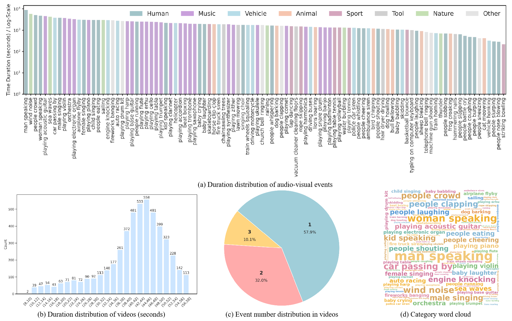

<h2 align="center"> <a href="https://arxiv.org/abs/2511.16901">R-AVST: Empowering Video-LLMs with Fine-Grained Spatio-Temporal Reasoning in Complex Audio-Visual Scenarios</a></h2>

<h4 align="center"> Lu Zhu, Tiantian Geng, Yangye Chen, Teng Wang, Ping Lu, Feng Zheng </h3>

<h5 align="center"> If our project helps you, please give us a star 🌟 and cite our <a href="#Citation">paper</a>!</h2>


[[🌐 Project Page](https://github.com/zhlllau/R-AVST/)] [[📖 Paper](https://arxiv.org/abs/2511.16901)] [[🤗 R-AVST Dataset (Hugging face)](https://huggingface.co/datasets/)]

## 🔥 News
- 2025-11-21. We release the paper. Welcome to follow.
- 2025-11-08. R-AVST is accepted at AAAI 2026. 🎉
  
## 🔭 Overview
Recently, rapid advancements have been made in multimodal large language models (MLLMs), especially in video understanding tasks. However, current research focuses on simple video scenarios, failing to reflect the complex and diverse nature of real-world audio-visual events in videos. To address this gap,
- We introduce R-AVST✨, the first video dataset encompassing a wide range of complex audio-visual events and featuring fine-grained spatio-temporal annotations, specifically designed to facilitate multimodal reasoning and evaluation in realistic scenarios of videos. 
- Aiming to systematically evaluate models’ spatiotemporal reasoning capabilities and to align more closely with human retrieval demands in complex audio-visual contexts, we introduce three specialized tasks✨: AudioVisual Temporal, Spatial, and Spatio-Temporal Reasoning, alongside automatically constructed QAs based on LLM-generated labels.
- We construct AVST-Zero✨, a Video-LLM fine-tuned in fully GRPO, trained on R-AVST to enhance its performance on audio-visual spatio-temporal reasoning tasks. Experimental results demonstrate that AVST-Zero achieves competitive performance across all three core tasks, validating its effectiveness.
<div align="center">
    
    <br/>
    <figcaption></figcaption>
</div>

## 🔧 Requirements 
 
We recommend setting up a conda environment for the project:
```shell
conda create --name=ravst python=3.10
conda activate ravst
pip install torch==2.6.0 torchvision==0.21.0 torchaudio==2.6.0 --index-url https://download.pytorch.org/whl/cu124
pip install -r requirements.txt
pip install flash-attn --no-build-isolation
```


## ✨ Dataset
### Annotation files of training and evaluation sets
| Split           | Download | # Videos | # QAs | 
|-----------------|----------|-----------------|-----------|
|Training set | [🤗 link](https://huggingface.co/datasets/Lu222/R-AVST/raw/main/xml_train_QA.json)| 4,171 | 6,533 | 
|Evaluation set | [🤗 link](https://huggingface.co/datasets/Lu222/R-AVST/raw/main/xml_test_QA.json)| 1,066 |1,633 | 


**[Note]** The json files include the information of video_name (YouTube id), duration, annotation (event_num, reasoning QAs).

## Evaluation
[Coming soon] For evaluation instruction, please refer to [eval.md](AVST-Zero/eval/eval.md)

## Training
[Coming soon] If you want to train the model by youself, please refer to [train.md](AVST-Zero/train/train.md) for training instructions. 


## Acknowledgement
We are grateful for the following awesome projects: 
[UnAV-100](https://unav100.github.io/)
[Videochat-R1](https://github.com/OpenGVLab/VideoChat-R1)
  

## Citation
If you find our project are useful for your research, please consider citing:
```
@article{zhu2025r,
  title={R-AVST: Empowering Video-LLMs with Fine-Grained Spatio-Temporal Reasoning in Complex Audio-Visual Scenarios},
  author={Zhu, Lu and Geng, Tiantian and Chen, Yangye and Wang, Teng and Lu, Ping and Zheng, Feng},
  journal={arXiv preprint arXiv:2511.16901},
  year={2025}
}
```
